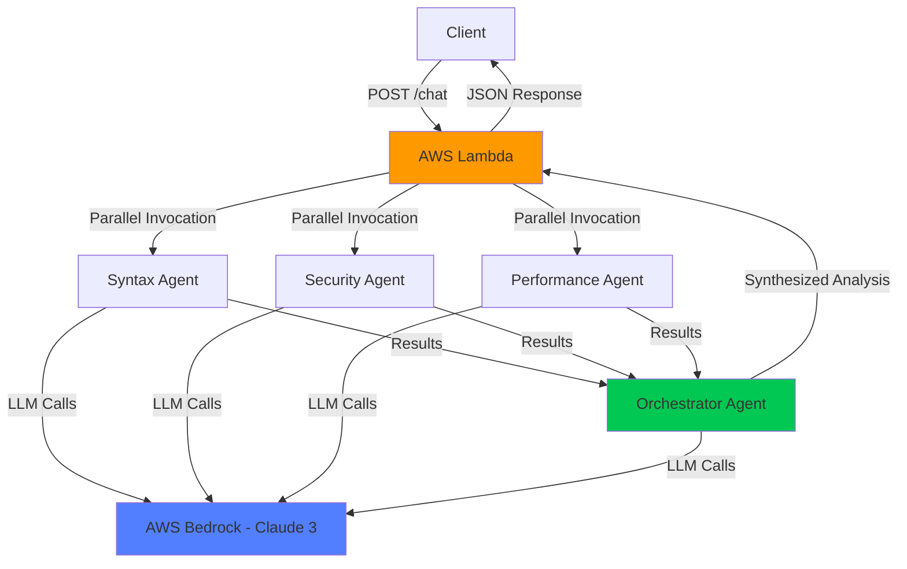
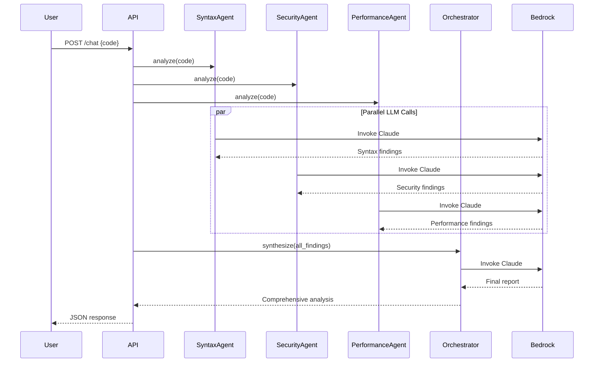
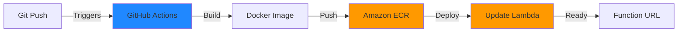

# Architecture & Design Philosophy

> **AI-Powered Multi-Agent Code Analysis System**  
> A production-ready serverless application demonstrating advanced AI engineering patterns, distributed agent orchestration, and cloud-native architecture.

---

## Table of Contents

- [System Overview](#system-overview)
- [Design Philosophy](#design-philosophy)
- [Architecture Patterns](#architecture-patterns)
- [Multi-Agent System](#multi-agent-system)
- [Technology Stack](#technology-stack)
- [Trade-offs & Decisions](#trade-offs--decisions)
- [Scalability & Performance](#scalability--performance)
- [Future Enhancements](#future-enhancements)

---

## System Overview

This application analyzes Kotlin code using a **multi-agent AI system** powered by AWS Bedrock (Claude 3). It demonstrates enterprise-grade patterns for building intelligent, scalable, and cost-effective AI applications.



---

## Design Philosophy

### 1. **Agentic AI Architecture**

Instead of a monolithic LLM call, the system uses **specialized agents** that work collaboratively:

- **Separation of Concerns**: Each agent focuses on one domain (syntax, security, performance)
- **Parallel Execution**: Agents run concurrently using Python's `asyncio` for faster analysis
- **Synthesis**: An orchestrator agent combines findings into a cohesive report

**Why this matters**: This mirrors how expert teams work—specialists analyze different aspects, then a lead synthesizes the findings. It produces higher-quality results than a single generalist prompt.

### 2. **Serverless-First Design**

The entire system runs on **AWS Lambda** with container images:

- **No server management**: Focus on business logic, not infrastructure
- **Automatic scaling**: Handles 1 or 1,000 requests without configuration
- **Pay-per-use**: Only charged for actual execution time

**Trade-off**: Cold starts (~8 seconds) vs. always-on servers. Acceptable for code analysis workflows where quality > speed.

### 3. **Infrastructure as Code**

All resources are defined via:
- **Dockerfile**: Reproducible container image
- **GitHub Actions**: Automated CI/CD pipeline
- **AWS CLI commands**: Documented setup process

**Benefit**: The entire stack can be destroyed and recreated in minutes. Perfect for experimentation and cost control.

---

## Architecture Patterns

### Pattern 1: Multi-Agent Orchestration

**Problem**: Single LLM prompts struggle with complex, multi-faceted analysis.

**Solution**: Decompose the problem into specialized sub-tasks.

```python
# Pseudocode
async def analyze_code(code):
    # Run specialized agents in parallel
    results = await asyncio.gather(
        syntax_agent.analyze(code),
        security_agent.analyze(code),
        performance_agent.analyze(code)
    )
    
    # Orchestrator synthesizes findings
    final = await orchestrator.synthesize(results)
    return final
```

**Benefits**:
- Higher quality (specialized expertise)
- Faster (parallel execution)
- Composable (easy to add new agents)

### Pattern 2: Async I/O with Thread Pool

**Challenge**: AWS Bedrock SDK (`boto3`) is synchronous, but FastAPI is async.

**Solution**: Use `asyncio.to_thread()` to run blocking calls in a thread pool:

```python
response = await asyncio.to_thread(self.client.invoke, prompt)
```

**Why**: Prevents blocking the event loop while maintaining clean async/await syntax.

### Pattern 3: Streaming Response Parsing

Bedrock returns **streaming JSON chunks**. We parse incrementally:

```python
for event in response_stream["body"]:
    chunk = json.loads(event["chunk"]["bytes"])
    if chunk["type"] == "content_block_delta":
        completion += chunk["delta"].get("text", "")
```

**Benefit**: Lower latency (start processing before full response arrives).

---

## Multi-Agent System

### Agent Responsibilities

| Agent | Role | Focus |
|-------|------|-------|
| **SyntaxAgent** | Kotlin Expert | Idiomatic code, language features, best practices |
| **SecurityAgent** | AppSec Specialist | Vulnerabilities, secrets, injection risks |
| **PerformanceAgent** | Optimization Expert | Memory leaks, CPU bottlenecks, inefficiencies |
| **Orchestrator** | Technical Lead | Synthesizes findings, prioritizes issues, provides actionable summary |

### Communication Flow



### Error Handling & Resilience

- **Graceful Degradation**: If an agent fails, the system continues with partial results
- **Fallback Logic**: If orchestrator fails, a simple combination is returned
- **Structured Errors**: All errors return JSON with type/message for client handling

---

## Technology Stack

### Core Technologies

- **Python 3.11**: Modern async/await, type hints, performance improvements
- **FastAPI**: High-performance async web framework
- **Mangum**: ASGI adapter for AWS Lambda
- **AWS Bedrock**: Managed LLM service (Claude 3 Sonnet)
- **Docker**: Containerized Lambda deployment

### AWS Services

- **Lambda**: Serverless compute (container image, 1024 MB, 15-min timeout)
- **ECR**: Container registry for Docker images
- **IAM**: Role-based access control
- **CloudWatch**: Centralized logging

### CI/CD Pipeline



**Workflow**:
1. Developer pushes to `stage` branch
2. GitHub Actions builds Docker image on Linux (avoids Mac manifest issues)
3. Image pushed to ECR
4. Lambda function code updated with new image
5. Zero-downtime deployment

---

## Trade-offs & Decisions

### 1. Container Images vs. Zip Archives

**Chosen**: Container images

**Why**:
- ✅ 10 GB size limit (vs. 250 MB for zip)
- ✅ Use standard Docker tooling
- ✅ Easier dependency management (pip install in Dockerfile)
- ❌ Slower cold starts (~8s vs. ~3s)

**Rationale**: For LLM applications with large dependencies (CrewAI, transformers, etc.), the size limit is critical.

### 2. Multi-Agent vs. Single Prompt

**Chosen**: Multi-agent system

**Why**:
- ✅ Higher quality (specialized analysis)
- ✅ Composable (add new agents easily)
- ✅ Parallel execution (faster)
- ❌ More LLM calls (higher cost)
- ❌ More complex codebase

**Rationale**: Quality and showcase value > cost. This demonstrates advanced agentic AI patterns.

### 3. Async Job Queue vs. Synchronous

**Chosen**: Synchronous (removed job system)

**Why**:
- ✅ Simpler architecture
- ✅ FastAPI handles concurrency via async/await
- ✅ Lambda's 15-min timeout is sufficient
- ❌ Client must wait for response

**Rationale**: Lambda's ephemeral environment makes job queues unreliable. For production at scale, use SQS + separate worker Lambdas.

### 4. Bedrock vs. OpenAI API

**Chosen**: AWS Bedrock

**Why**:
- ✅ No API keys to manage (IAM roles)
- ✅ Pay-as-you-go (no monthly subscriptions)
- ✅ Enterprise-grade compliance (HIPAA, SOC 2)
- ✅ Same VPC as other AWS resources
- ❌ Regional availability varies
- ❌ Slightly higher latency than direct OpenAI

**Rationale**: Better for production workloads. IAM-based auth is more secure than API keys.

---

## Scalability & Performance

### Current Capacity

- **Concurrency**: Lambda can scale to **1,000 concurrent executions** (default limit)
- **Throughput**: ~6 requests/minute/agent (due to LLM latency)
- **Cost**: ~$0.10 per 100 analyses (Lambda + Bedrock charges)

### Bottlenecks

1. **LLM Latency**: Bedrock calls take 2-3 seconds each
2. **Cold Starts**: First request after idle takes ~8 seconds
3. **Memory**: 1024 MB is sufficient; could reduce to 512 MB for cost savings

### Optimization Strategies

#### Implemented:
- ✅ Parallel agent execution (3x speedup)
- ✅ Streaming responses (lower perceived latency)
- ✅ Connection pooling (boto3 client reuse)

#### Future:
- **Prompt Caching**: Reduce token costs by 90% for repeated prefixes
- **Provisioned Concurrency**: Eliminate cold starts for critical paths
- **API Gateway + Lambda**: Add caching, throttling, API keys

---

## Future Enhancements

### 1. **Retrieval Augmented Generation (RAG)**

Add a vector database (Pinecone/Weaviate) with:
- Kotlin best practices documentation
- Security vulnerability databases (OWASP, CVE)
- Performance optimization guides

**Benefit**: Agents can reference authoritative sources, improving accuracy.

### 2. **Guardrails**

Integrate AWS Bedrock Guardrails:
- **Content filtering**: Block PII, profanity, malicious code
- **Topic blocking**: Prevent off-topic responses
- **Prompt injection detection**: Security layer

### 3. **Streaming to Client**

Return results as they arrive (Server-Sent Events):
```
data: {"agent": "SyntaxAgent", "status": "complete", "findings": [...]}
data: {"agent": "SecurityAgent", "status": "complete", "findings": [...]}
data: {"agent": "Orchestrator", "status": "complete", "report": "..."}
```

**Benefit**: Better UX—users see progress in real-time.

### 4. **Code Improvement Agent**

Add an agent that generates **fixed code**:
- User approves specific issues
- Agent rewrites code sections
- Returns diff or full corrected file

### 5. **Metrics & Observability**

- **CloudWatch Dashboards**: Request latency, error rates, cost per analysis
- **X-Ray Tracing**: Visualize agent execution flow
- **Custom Metrics**: Track agent success rates, prompt quality

---

## Conclusion

This architecture demonstrates:

✅ **Advanced AI Engineering**: Multi-agent orchestration, streaming, async patterns  
✅ **Cloud-Native Design**: Serverless, containerized, auto-scaling  
✅ **Production Readiness**: Error handling, logging, CI/CD, IAM security  
✅ **Cost Efficiency**: Pay-per-use, no idle resources  
✅ **Scalability**: Handles 1 to 1,000+ concurrent users  

**Key Takeaway**: Building effective AI systems requires thoughtful architecture—not just calling an LLM. This project showcases the engineering discipline needed to create reliable, scalable, and maintainable AI applications.

---

*For questions or collaboration, see [README.md](./README.md).*
