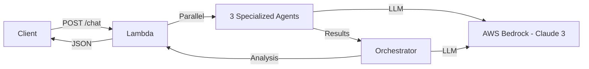

# AI Dev Companion

> **Multi-Agent AI Code Analysis System**  
> Production-ready serverless application for intelligent Kotlin code review powered by AWS Bedrock (Claude 3).

[/badge.svg)](https://github.com/Amehran/AIDevCompanionDev/actions)
[](LICENSE)

---

## 🚀 Features

- **Multi-Agent Analysis**: Specialized AI agents for syntax, security, and performance
- **Serverless Architecture**: AWS Lambda with container images (scales to 1000+ concurrent requests)
- **Conversation Memory**: Multi-turn conversations with context retention
- **Android Client**: Native Jetpack Compose application for mobile access
- **Real-time Streaming**: Bedrock streaming API for responsive UX
- **Production-Ready**: Error handling, rate limiting, structured logging, CI/CD

## 📚 Documentation

- **[Architecture & Design](./ARCHITECTURE.md)** - Deep dive into system design, patterns, and technical decisions
- **[API Documentation](#api-reference)** - Endpoint specifications
- **[Deployment Guide](#deployment)** - AWS setup and GitHub Actions workflow
- **[Android Client](./android-client/README.md)** - Mobile application documentation

---

## 🏗️ Architecture



**Key Components**:
- **SyntaxAgent**: Analyzes Kotlin idioms and best practices
- **SecurityAgent**: Detects vulnerabilities and secrets
- **PerformanceAgent**: Identifies bottlenecks and optimizations
- **Orchestrator**: Synthesizes findings into actionable report

---

## ⚡ Quick Start

### Prerequisites

- Python 3.11+
- AWS Account (for Bedrock access)
- Docker (for containerized deployment)

### Local Development

```bash
# Clone repository
git clone https://github.com/Amehran/AIDevCompanionDev.git
cd AIDevCompanionDev

# Run local server
./scripts/local_run.sh

# Test endpoint
curl -X POST "http://localhost:8000/chat" \
  -H "Content-Type: application/json" \
  -d '{"source_code": "fun main() { println(\"Hello\") }"}'
```

### Environment Variables

Create `.env`:

```bash
AWS_REGION=us-east-1
MODEL_ID=anthropic.claude-3-sonnet-20240229-v1:0
RATE_LIMIT_PER_MINUTE=10
```

---

## 🌐 API Reference

### POST /chat

Analyze Kotlin code with multi-agent system.

**Request**:
```json
{
  "source_code": "fun main() { val password = \"secret123\" }"
}
```

**Response**:
```json
{
  "summary": "Code analysis complete. Found 1 security issue.",
  "issues": [
    {
      "type": "SECURITY",
      "description": "Hardcoded credentials detected",
      "suggestion": "Use environment variables or secure key storage"
    }
  ],
  "conversation_id": "uuid"
}
```

### Continue Conversation

```json
{
  "conversation_id": "uuid",
  "message": "Can you fix the security issue?"
}
```

---

## 🚢 Deployment

### AWS Lambda (Recommended)

**1. Setup AWS Resources**

```bash
# Create ECR repository
aws ecr create-repository --repository-name ai-dev-companion --region us-east-1

# Create IAM role
aws iam create-role --role-name ai-dev-companion-role \
  --assume-role-policy-document file://trust-policy.json

# Attach permissions
aws iam attach-role-policy --role-name ai-dev-companion-role \
  --policy-arn arn:aws:iam::aws:policy/service-role/AWSLambdaBasicExecutionRole
aws iam attach-role-policy --role-name ai-dev-companion-role \
  --policy-arn arn:aws:iam::aws:policy/AmazonBedrockFullAccess
```

**2. Deploy via GitHub Actions**

```bash
# Push to stage branch to trigger deployment
git push origin main:stage
```

GitHub Actions will:
- Build Docker image (Linux/amd64)
- Push to Amazon ECR
- Update Lambda function
- Create/update Function URL

**Function URL**: Accessible at `https://<unique-id>.lambda-url.us-east-1.on.aws/`

---

## 🧪 Testing

```bash
# Run all tests
pytest

# Run specific test suite
pytest tests/test_agents.py -v

# Run in virtual environment
python3 -m venv venv && source venv/bin/activate
pip install pytest pytest-asyncio
pytest
```

**Test Coverage**:
- ✅ Agent unit tests
- ✅ API integration tests
- ✅ Bedrock client mocking
- ✅ Error handling scenarios

---

## 🛠️ Tech Stack

| Component | Technology |
|-----------|------------|
| **Backend** | FastAPI (async Python) |
| **LLM** | AWS Bedrock - Claude 3 Sonnet |
| **Deployment** | AWS Lambda (Container Images) |
| **CI/CD** | GitHub Actions |
| **Container** | Docker |
| **Testing** | Pytest, httpx |

---

## 📊 Performance

- **Cold Start**: ~8 seconds
- **Warm Request**: 2-3 seconds (LLM latency)
- **Concurrency**: Scales to 1000+ concurrent requests
- **Cost**: ~$0.10 per 100 analyses

---

## 🗺️ Roadmap

- [ ] **RAG Integration**: Add vector database for code examples
- [ ] **Guardrails**: Content filtering and safety checks
- [ ] **Streaming to Client**: Real-time results via SSE
- [ ] **Code Improvement**: Generate fixed code automatically
- [ ] **Metrics Dashboard**: CloudWatch/X-Ray observability

---

## 🤝 Contributing

Contributions welcome! See [CONTRIBUTING.md](CONTRIBUTING.md).

1. Fork the repository
2. Create feature branch (`git checkout -b feature/amazing-feature`)
3. Commit changes (`git commit -m 'Add amazing feature'`)
4. Push to branch (`git push origin feature/amazing-feature`)
5. Open Pull Request

---

## 📝 License

This project is licensed under the MIT License - see [LICENSE](LICENSE) file.

---

## 🙏 Acknowledgments

- AWS Bedrock team for Claude 3 API
- FastAPI community
- CrewAI for multi-agent inspiration

---

## 📧 Contact

**Armin Mehran** - [GitHub](https://github.com/Amehran)

**Project Link**: [https://github.com/Amehran/AIDevCompanionDev](https://github.com/Amehran/AIDevCompanionDev)
